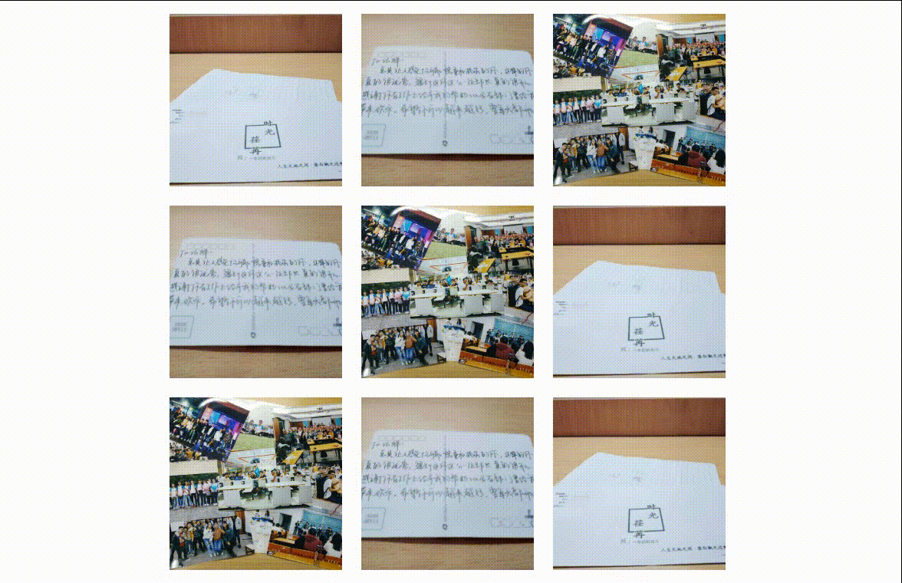
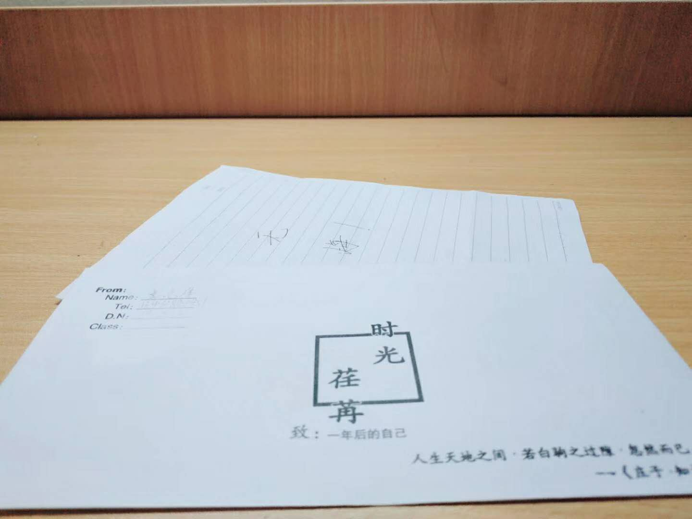

# 图片随鼠标滑动效果

原生js实现图片随鼠标滑动效果：mouse-slide

演示demo地址：[鼠标滑动效果演示](https://jeffrey-0.github.io/mouse-slide/)

项目地址：[鼠标滑动效果](https://github.com/Jeffrey-0/mouse-slide)

## 效果图




## 快速开始

CSS样式

```html
<link rel="stylesheet" type="text/css" href="https://jeffrey-0.github.io/mouse-slide/index.css">
```

HTML结构

```html
<div class="item">
  
  <div class="">显示标题</div>
</div>
```

JS脚本

```html
<!-- 引入mouse-slide插件 -->
<script type="text/javascript" src="https://jeffrey-0.github.io/mouse-slide/index.js"></script>
<!-- 使用slider插件 -->
<script type="text/javascript">
  mouseSlide('item', 500)
  // 参数1： className 要滑动的div的父级类名，默认为item
  // 参数2： animationDuration 滑动的时间/单位毫秒，默认为500
</script>
```

> 第二种：建议下载本项目[鼠标滑动效果](https://github.com/Jeffrey-0/mouse-slide)到本地，再引入，加快速度

## 兼容性

* 兼容谷歌、火狐、IE9+等主流浏览器(IE9及以下只显示不滑动)
